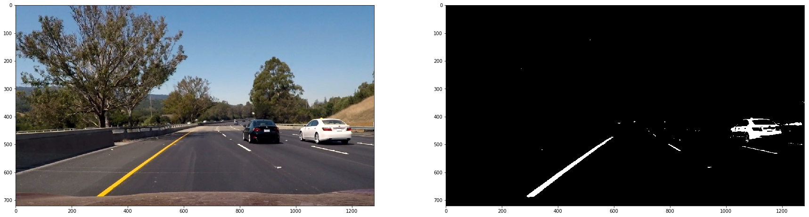
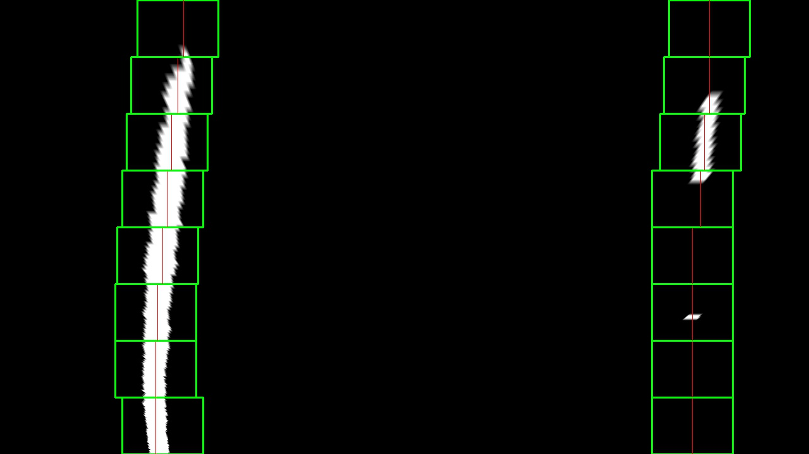

# Advanced Lane Finding Using OpenCV

This project is part of the [Udacity Self-Driving Car Nanodegree Program](https://github.com/udacity/CarND-Traffic-Sign-Classifier-Project). The goals / steps of this project are the following:

* Compute the camera calibration matrix and distortion coefficients given a set of chessboard images.
* Apply a distortion correction to raw images.
* Use color transforms, gradients, etc., to create a thresholded binary image.
* Apply a perspective transform to rectify binary image ("birds-eye view").
* Detect lane pixels and fit to find the lane boundary.
* Determine the curvature of the lane and vehicle position with respect to center.
* Warp the detected lane boundaries back onto the original image.
* Output visual display of the lane boundaries and numerical estimation of lane curvature and vehicle position.

The main pipeline is in [advanced_lane_finder.ipynb](advanced_lane_finder.ipynb).

## 1. Camera calibration and undistortion

The physical imperfections in cameras lead to distortions in the images that they capture. I need to correct these distortions through a camera-specific calibration procedure. This procedure determines the coefficients used in polynomial expressions that correct radial and transverse distortions. I also need to determine the focal length(s) and lens offset(s) of the specific camera that captured the images I will use. A detailed description of this is [here](http://docs.opencv.org/3.0-beta/doc/py_tutorials/py_calib3d/py_calibration/py_calibration.html).

The code for the calibration is in calibrateCamera(). Using the provided chessboard images, I find the chessboard corners, draw them on the image, and then refine them using cv2.cornerSubPix(). This function uses the fact that the gradient at every point near the corner is orthogonal to the vector between the corner and that point; iteratively minimizing the dot product of the gradient and corner-to-point vector refines the corner position.

One complication is that I don't know the real-world coordinates of the chessboard corners, relative to the camera. But I can handle this by shifting our reference frame to use the chessboard itself as the origin (0,0,0) of the real-world coordinates. I can also use the size of a chessboard square as the unit distance in the real world, so the corner coordinates are now really simple: (1,0,0),(2,0,0),(1,1,0),etc. This seems like a trick, but it's just using smart rescaling of coordinates. 

Next I take the list of image points and object points and use cv2.calibrateCamera() to determine the camera matrix (which specifies the intrinsic camera features: focal lengths and lens offsets) and the coefficients for the distortion-correction polynomials. Using this matrix and coefficients, it's straightforward to undistort new images from this camera using cv2.undistort().

## 2. Creating a thresholded binary image of lane pixels

This is the most challenging part of the project, and the code is in selectLanePixels(). Following the course examples and some of the discussion from other students, I convert the image to HLS color space, and select pixels in a (high) range of the S channel. This is very good at picking up the yellow lane line, even in shadow. The white lane line is much more difficult. After initially trying to use the L channel of the HSL color space, I settled on a combination of the L channel (which indicates brightness/lightness) in LAB color space, and evaluating the x-gradient using a Sobel operator on a grayscale image. (Using LAB color space was inspired by various comments from students on the Slack channel.) This combination is less effective, mostly in the shadowed areas (it seems to handle the light-colored pavement relatively well). The union of all pixels that passed at least one test is then returned as a binary (one-channel) image. 

## 3. Calculating the perspective transform and warping image

To transform the image perspective to a birds-eye view, I first use two test images of straight road segments to calculate the vanishing point for this camera view with findVanishingPoint(). I do this with techniques from the first project: a gaussian blur to smooth the image; a Canny edge detector to find the lines in the ROI; and a Hough transform to find the dominant lines. Once I have the lines, I have to calculate where they intersect, which is the vp. There may be more than two of them, so I use a linear algebra technique: rearrange the slope and intercept to form a matrix, and solve using numpy's least squares function.

Once I have the vanishing point, it's easy to determine the four corner points of the ROI; I set vertical limits on the ROI and calculate the horizontal positions that fall on the vanishing lines. Using those four points and the four corners of the ROI, I use cv2.getPerspectiveTransform() to determine the warping matrix (within the function calculatePerspectiveTransform() ). I can then apply it easily using cv2.warpPerspective().

## 4. Detect lane pixels and fit lane lines

To detect the lanes, I warp the binary image of lane pixels to the birds-eye view, using the perspective transform I just calculated. I then use the sliding-window technique. To do this intuitively, I use a Lane class, defined at the beginning of the notebook, and create two instances for the left and right lanes. This class has a method findAndFit(), which attempts to find the centroid of the lane at various heights in the image (windows) based on the detected lane pixels. For efficiency, once it has successfully detected the lane at one window, it uses that horizontal point to beginning the search in the window above, over a smaller horizontal range of pixels. After some experimentation, I ended up using 8 total windows, with a window width of 128 pixels. The horizontal and vertical positions of the lane in these windows are then fit using a second-order polynomial.

## 5. Draw lane on original image and calculate curvature and lane offset 

I save the lane fits from the last 8 frames, and use this to compute and draw the lane position in the warped space, in the function drawLane(). Next I warp back to the original view (using the inverse perspective transform calculated above) and impose this lane marker on the frame. 

I calculate the lane offset by simply determining the lane center from the position of the two lane lines, and determine how far off center in the image this is. Using the provided conversion from pixels to meters, I can calculate the true offset. This is under 30 cm in most frames, which makes sense. Calculating the lane curvature is slightly more difficult. Using the  formula for curvature from a second-order polynomial fit, I have to accurately include the x and y pixel calibration in the fit formula. The algebra for doing that is encapsulated in the Lane class function calculateCurvature(), which also averages the curvature of previous frames. I write the offset and curvature directly onto the frame using cv2.putText().

The video of the entire pipeline applied to the project video is [here](./output_video/video_output.mp4). The pipeline performs reasonably well in the project video, although it struggles a little with the shadow regions. This isn't too surprising, since it's difficult to distinguish the white lines in the shadow, and the L channel isn't very helpful. The frame averaging technique helps somewhat. 

## 6. Ideas.

1. Improving centroid finding in the sliding window technique. Right now the pipeline integrates the window pixels vertically (a histogram) and then identifies all non-zero positions with np.flatnonzero(). Taking the mean of this gives the mean index position of these non-zero vertical integrations of pixels, a generally effective technique. It tends to fail when the pixel detection has mostly picked up edges, or when there are any stray pixels around. This could be improved by thresholding the histogram to drop any horizontal positions that have too few (but not zero) pixels.

2. Implementing shadow-based detection. The lane pixel identification method struggles in shadow. There are algorithms to identify shadowed pixels, based on the physical property that shadows are bluer than sunlight pixels (due to Rayleigh scattering) - see [this paper](https://asp-eurasipjournals.springeropen.com/articles/10.1186/1687-6180-2012-141). It might be possible to first identify pixels that are in shadow in the raw (undistorted) images, and then apply a different lane-pixel-finding algorithm to them, possibly just by using different threshold values in HSL or LAB color space. 

3. Better sanity checks and look-ahead. Since lanes can't actually change curvature faster than a certain amount, it should be possible to threshold between frames on this amount and discard fits that are obviously outside of this tolerance. As for look-ahead, there is information in the image very close to the vanishing point that we're not currently using, because it's just outside of the ROI. It might be possible to divide the field of view into two vertical slices, and calculate fits and curvature in them separately. That would give us a second sanity check, because the following frame should find the curvature of the lower ROI changing to be closer to the curvature of the previous frame's upper ROI.
